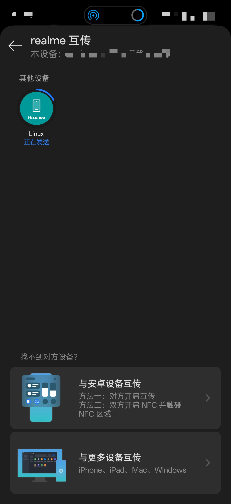

# Linshare

###  你的 Linux 设备现已加入互传联盟 :) 

## 功能

- 设备发现  ✅️
- 文件接收  ✅️
- 文件发送  ✅️
- 缩略图    
- 批量发送
- GUI

## 系统要求

- Linux 系统 (Ubuntu 26.04上进行的开发)
- BlueZ >= 5.84-4
- Python 3.14 
- AX210（其他蓝牙模块请自行测试）
- udhcpd 

#### 安装 BlueZ（Ubuntu/Debian）

```bash
sudo apt update
sudo apt install bluez
sudo apt install udhcpd
```

#### Python 依赖
```bash
dbus-python
websockets
```

## 启动
### 接收
```bash
python3 receiver.py
```
### 发送
```bash
sudo python3 wlan0 demo.jpg
```

## 演示



## 参考项目

- [CatShare](https://github.com/kmod-midori/CatShare) 
